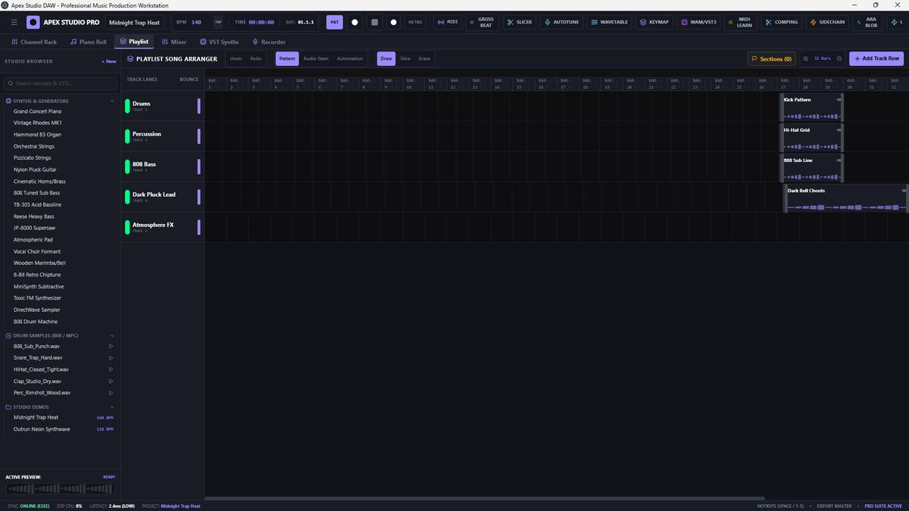
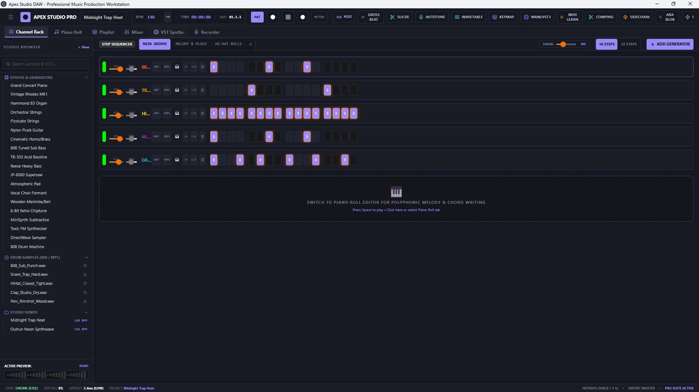
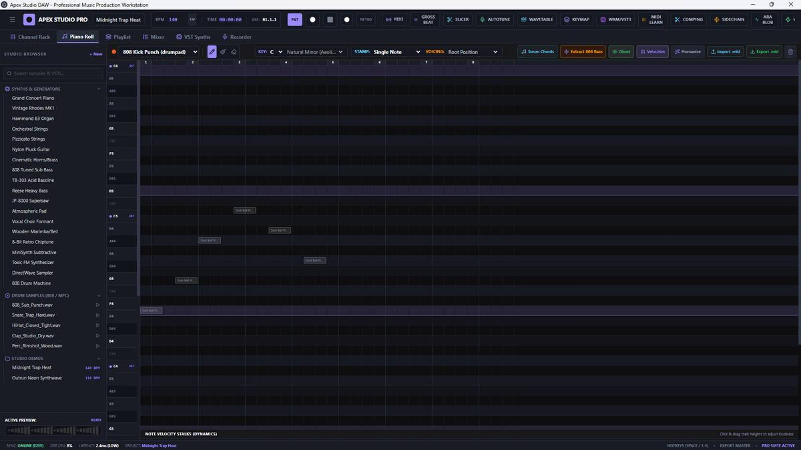
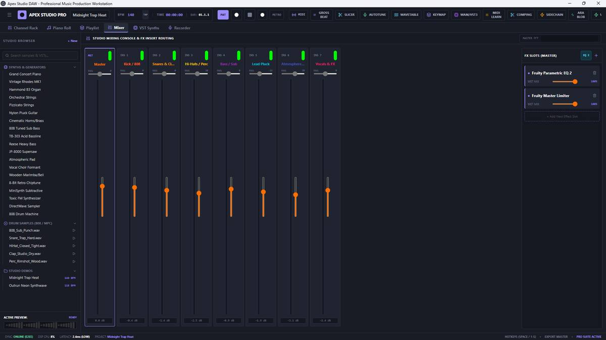
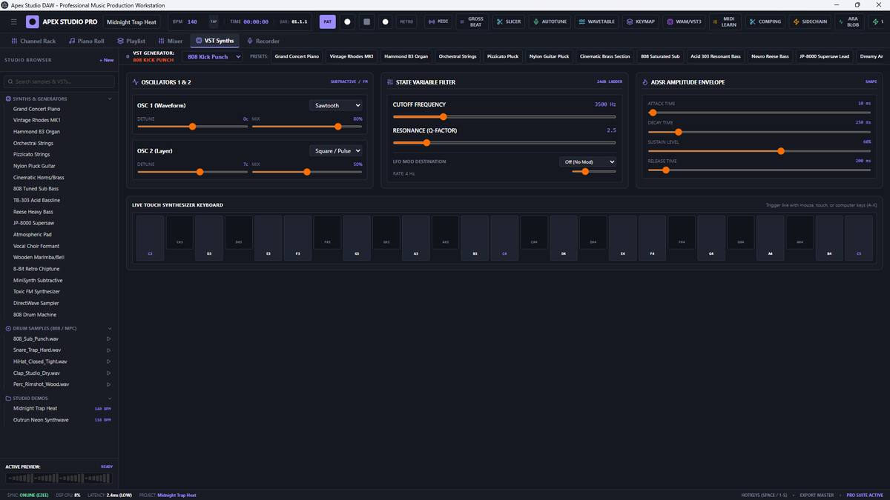
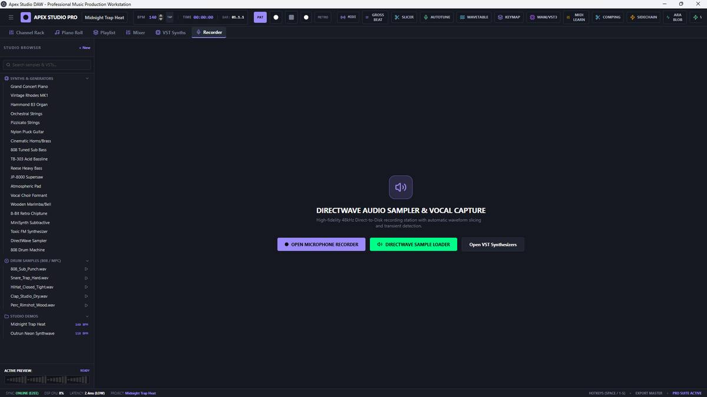

<div align="center">

# 🎛️ Apex Studio

### A free, local-first DAW for making music.

**Create. Arrange. Record. Mix. Export.**

Build beats, write melodies, arrange tracks, record audio, shape your mix, and export your work — without a subscription or cloud-first workflow.

<br />

[](https://github.com/Ajey877/Apex-Studio/releases)
[](https://github.com/Ajey877/Apex-Studio/actions/workflows/ci.yml)
[](https://github.com/Ajey877/Apex-Studio/actions/workflows/audio-validation.yml)
[](https://github.com/Ajey877/Apex-Studio/actions/workflows/desktop-validation.yml)

<br />

[🚀 **Download Apex Studio v1.1.0**](https://github.com/Ajey877/Apex-Studio/releases/tag/v1.1.0) · [📖 **Documentation**](#-getting-started) · [🐛 **Report a Bug**](https://github.com/Ajey877/Apex-Studio/issues/new/choose) · [💡 **Request an Improvement**](https://github.com/Ajey877/Apex-Studio/issues/new/choose)

</div>

---

## ✨ What is Apex Studio?

Apex Studio is a creator-focused digital audio workstation built around a simple idea:

> **Music software should help you make music, not get in the way.**

It brings the main parts of a music-production workflow into one application — from the first drum pattern to the final WAV export.

### The workflow

```text
        CREATE
          ↓
        EDIT
          ↓
       ARRANGE
          ↓
       RECORD
          ↓
         MIX
          ↓
        SAVE
          ↓
       EXPORT
```

**v1.1.0** is a Windows-focused release with a browser development workflow and automated validation for the core audio, history, build, and desktop configuration paths.

---

## 🎬 See Apex Studio

### 🎛️ Your studio, in one place

<p align="center">
  
</p>

<p align="center">
  <b>Playlist Arranger</b><br>
  Build your arrangement across patterns, audio clips and automation.
</p>

<br />

<table>
<tr>
<td width="50%">



### 🥁 Channel Rack
Program beats, patterns, swing and velocity.

</td>
<td width="50%">



### 🎹 Piano Roll
Write melodies, chords and detailed note performances.

</td>
</tr>
<tr>
<td width="50%">



### 🎚️ Mixer
Balance channels, route audio and shape your mix.

</td>
<td width="50%">



### 🎛️ Synth
Shape sounds with oscillators, filters and modulation.

</td>
</tr>
</table>

<br />

<p align="center">
  
</p>

<p align="center">
  <b>🎙️ Record directly into your project.</b>
</p>

---

## 🎚️ Built for the actual workflow

| 🎹 Workspace | What it does |
|---|---|
| **Channel Rack** | Build patterns with step sequencing, swing, velocity and MIDI learn. |
| **Piano Roll** | Create polyphonic melodies, edit note length and velocity, use scales/chords and quantization tools. |
| **Playlist Arranger** | Arrange patterns and audio clips across multiple lanes, including automation. |
| **Mixer** | Work across mixer tracks with volume, pan, routing, metering and insert effects. |
| **Synth** | Shape sounds with dual wavetable oscillators, filters, ADSR and modulation controls. |
| **Recording** | Capture audio and place recorded takes into the project. |
| **FX** | Use EQ, reverb, delay, compression and time/volume-style effects. |
| **Export** | Render WAV, export Standard MIDI, and create project/stem packages. |

---

## 🎵 Why Apex Studio?

### 🆓 Free to use
No subscription is required to run the project.

### 💾 Local-first
Your project workflow is designed around local storage and local processing rather than requiring a cloud account.

### 🎛️ One workflow
Step sequencing, piano roll editing, arrangement, recording, mixing and export live together instead of being split across separate tools.

### ↩️ Real project editing
Document-level undo/redo covers the core project state, with continuous controls grouped into meaningful history actions.

### 🔊 Real audio pipeline
Apex Studio uses Web Audio APIs for playback, mixing, effects, recording and offline rendering rather than being only a visual mock-up.

### 🖥️ Windows desktop build
The project can be packaged as a Windows installer or portable executable through Electron.

---

## 🚀 Get Apex Studio

### Windows — recommended for v1.1.0

Download the latest release from GitHub:

**👉 [Download Apex Studio v1.1.0](https://github.com/Ajey877/Apex-Studio/releases/tag/v1.1.0)**

The release workflow builds Windows packages including:

- **Windows installer (.exe)**
- **Portable Windows build**
- Release metadata generated by the build pipeline

> **Note:** Windows releases are generated by GitHub Actions. If you are looking at a release while its build is still running, wait for the release assets to appear.

### Run from source

Requirements:

- **Node.js 20 or newer**
- npm

```bash
git clone https://github.com/Ajey877/Apex-Studio.git
cd Apex-Studio
npm install
npm run dev
```

Open the local Vite URL shown in the terminal.

### Production build

```bash
npm run build
```

### Package Windows locally

```bash
npm install
npm run package:win
```

Build output is written to `dist-electron/`.

---

## ⚡ Your first session

### 1. 🥁 Start with a beat

Open **Channel Rack** and program a simple Kick, Snare, Hi-Hat or 808 pattern.

**Shortcut:** `F6` or `1`

### 2. 🎹 Write a melody

Open **Piano Roll**, draw notes, adjust their length and velocity, and use the available scale/chord tools.

**Shortcut:** `F7` or `2`

### 3. 🧩 Build the arrangement

Open **Playlist Arranger**, switch between pattern/song workflow as needed, and place patterns or audio clips on the timeline.

**Shortcut:** `F5` or `3`

### 4. 🎚️ Shape the mix

Open the **Mixer**, balance your channels, route tracks, and add effects.

**Shortcut:** `F9` or `4`

### 5. 🎙️ Record

Arm recording, capture audio, and place the take into your project.

**Shortcut:** `R`

### 6. 💾 Save and reopen

Use project save/reopen workflows to keep working across sessions.

**Shortcut:** `Ctrl + S`

### 7. 📦 Export

Render your finished work as WAV, export Standard MIDI, or create project/stem packages.

---

## ⌨️ Essential shortcuts

| Shortcut | Action |
|---|---|
| `Space` | Play / Pause |
| `L` | Pattern / Song Mode |
| `R` | Arm Recording |
| `M` | Metronome |
| `Ctrl + S` | Save Project |
| `Ctrl + Z` | Undo |
| `Ctrl + Y` | Redo |
| `F5` / `3` | Playlist Arranger |
| `F6` / `1` | Channel Rack |
| `F7` / `2` | Piano Roll |
| `F9` / `4` | Mixer & FX Rack |

---

## 🧪 Built with reliability in mind

Apex Studio is being developed with automated checks around the parts that matter most to a DAW: audio behavior, project state, desktop configuration and production builds.

The repository currently validates:

- ✅ TypeScript compilation
- ✅ Audio regression tests
- ✅ Project persistence/audio hydration tests
- ✅ Project history and undo/redo tests
- ✅ Desktop security configuration
- ✅ Production Vite builds
- ✅ Windows Electron packaging

Check the **Actions** tab for the current CI state:

**[View GitHub Actions →](https://github.com/Ajey877/Apex-Studio/actions)**

---

## 🧭 Product direction

Apex Studio is intentionally focusing on **trustworthy core DAW workflows before adding more headline features**.

That means the current priority is making this loop dependable:

> **Create → Edit → Arrange → Record → Mix → Save → Reopen → Export**

Features that are not production-ready are not presented as finished just for the sake of a bigger feature list.

### AI status

**Apex Studio currently does not include active AI generation, AI stem separation, or an AI API integration.** AI is intentionally outside the current core scope.

---

## 🛠️ Tech stack

- **React 19** — application UI
- **TypeScript** — application logic and type safety
- **Vite** — development and production web builds
- **Web Audio API** — audio playback, processing and rendering
- **Electron** — Windows desktop packaging
- **Electron Builder** — installer and portable builds
- **IndexedDB** — local project/audio persistence
- **Tailwind CSS** — UI styling

The project is designed to run locally and does not require a hosted backend for its core music-production workflow.

---

## 🤝 Feedback, bugs & contributions

Apex Studio is most useful when real producers tell us where the workflow breaks down.

When opening an issue, include:

1. **What you were trying to do**
2. **What you expected to happen**
3. **What actually happened**
4. **Steps to reproduce it**
5. **Browser/Windows environment**, if relevant

### Useful links

- 🐛 [Report a bug](https://github.com/Ajey877/Apex-Studio/issues/new/choose)
- 💡 [Open an issue / suggest an improvement](https://github.com/Ajey877/Apex-Studio/issues/new/choose)
- 🔀 [View pull requests](https://github.com/Ajey877/Apex-Studio/pulls)
- ⚙️ [View GitHub Actions](https://github.com/Ajey877/Apex-Studio/actions)
- 📦 [View releases](https://github.com/Ajey877/Apex-Studio/releases)

If Apex Studio is useful to you, **a GitHub star helps the project get discovered by other creators.** ⭐

---

## 📈 Version

**Current release: `v1.1.0`**

This release focuses on making the core project workflow more dependable, including audio rendering, project/audio hydration, persistence behavior, and document-level undo/redo.

See the [release page](https://github.com/Ajey877/Apex-Studio/releases/tag/v1.1.0) for the downloadable Windows build and release information.

---

## 📜 License

See the repository for the current licensing terms and distribution information.

---

<div align="center">

### 🎛️ Make music. Keep it local. Keep creating.

**Apex Studio — v1.1.0**

[⬇️ Download](https://github.com/Ajey877/Apex-Studio/releases/tag/v1.1.0) · [⭐ Star on GitHub](https://github.com/Ajey877/Apex-Studio) · [🐛 Report an issue](https://github.com/Ajey877/Apex-Studio/issues/new/choose)

</div>
